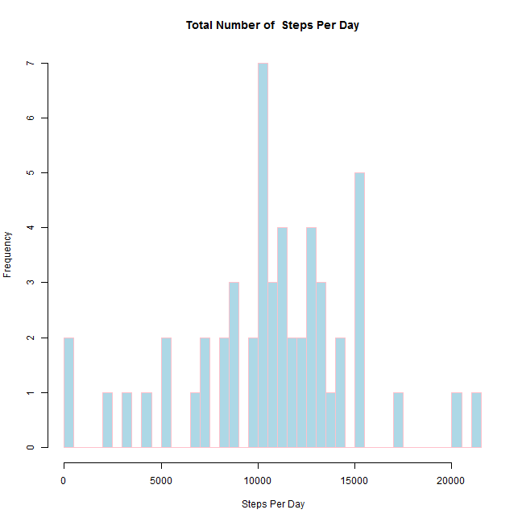
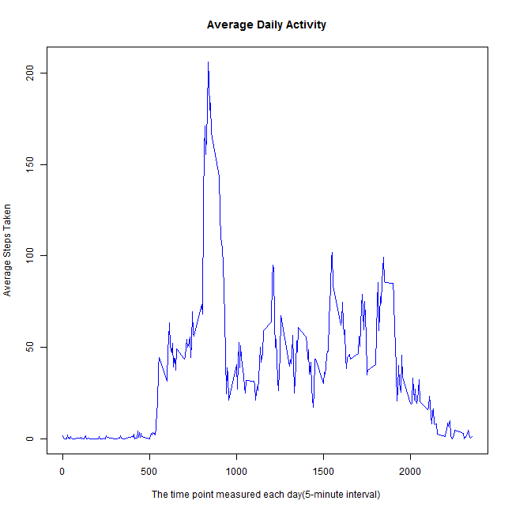
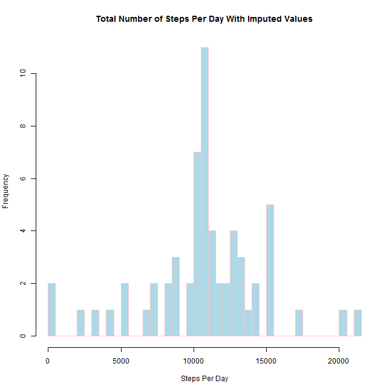
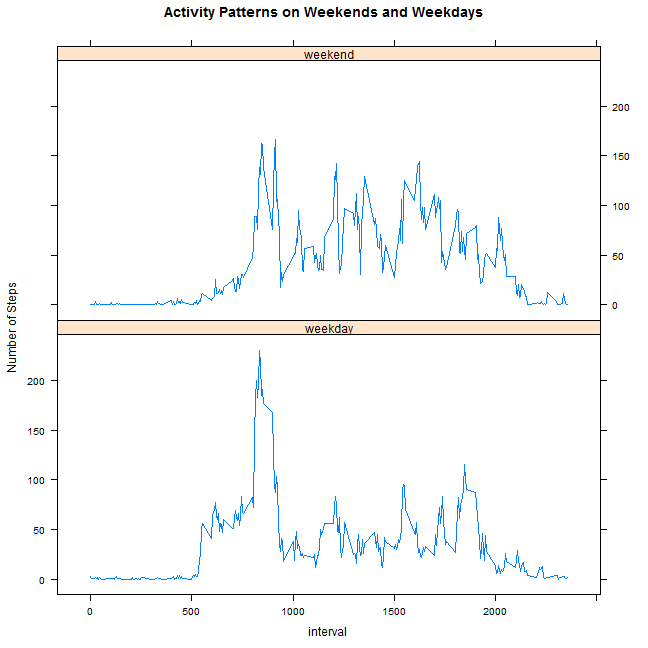

# Reproducible Research: Peer Assessment 1

## Loading and preprocessing the data


```r
## unzip the data set from the zip file
## Current working directory is displayed to the user 
getwd()
```

```
## [1] "C:/Users/i305271/dev/src/git-hub/RepData_PeerAssessment1"
```

```r
unzip("activity.zip")

# read the data into data frame dataFrame
dataFrame <- read.csv("activity.csv")
```

## What is mean total number of steps taken per day?


```r
# calculate  total number of steps per each day
steps_daily <- aggregate(steps~date, data=dataFrame, FUN =sum)
```

```r
# histogram of the total number of steps per each day
hist(steps_daily$steps, breaks=nrow(steps_daily), main="Total Number of Steps Per Day",
     xlab="Steps Per Day", col="blue")
```

 

```r
# Calculate the mean and median total number of steps taken per day
mean.steps_daily <- mean(steps_daily$steps)
median.steps_daily <- median(steps_daily$steps)
```
The mean total number of steps taken per day is 10766  
The median total number of steps taken per day is 10765

## What is the average daily activity pattern?


```r
# find the average number of steps per 5 minute interval steps
avg_interval <- aggregate(steps~interval, data=dataFrame, FUN=mean)
```

```r
# plot of the 5-min.interval and avg. steps taken over all days
plot(avg_interval, type="l", main="Average Daily Activity",
     xlab="5-minute Intervals taken each day", ylab="Average Steps Taken Over All Days")
```

 

```r
# find the 5-minute interval, on avg. steps over all days in   
# the dataset, that contains the maximum number of steps
max_interval <- avg_interval[which.max(avg_interval$steps),"interval"]
```
The 5-minute interval, on average across all the days in the dataset, that contains the maximum number of steps is 835


## Imputing missing values

```r
## calculate the number of missing values in the dataset 
num_missing <- sum(is.na(dataFrame))
```
The total number of missing values in the dataset is 2304.  

The missing values will be imputed by replacing step NAs with the mean of the 5-minute interval averaged over all days.


```r
# Create a vector of steps with NAs replaced by imputed value 
# (imputed with mean of the 5-minute interval)

new_steps <- numeric()
for(i in 1:nrow(dataFrame)) {
    temp <- dataFrame[i,]
    if (is.na(temp$steps)) {
        steps <- subset(avg_interval,interval==temp$interval)$steps
    } else {
        steps <- temp$steps
    }
    new_steps <- c(new_steps,steps)
}

## create a new dataset  with imputed steps for the missing steps.
new_dataFrame <- dataFrame
new_dataFrame$steps <- new_steps

# calculate the total number of steps per each day
new_steps_daily <- aggregate(steps~date, data=new_dataFrame, FUN=sum)
```

```r
# histogram of the total number of steps taken each day
hist(new_steps_daily$steps, breaks=nrow(new_steps_daily), 
     main="Total Number of Steps Per Day With Imputed Values",
     xlab="Steps Per Day", col="green")
```

 

```r
# Find the mean and median total number of steps taken per day
new_mean.steps_daily <- mean(new_steps_daily$steps)
new_median.steps_daily <- median(new_steps_daily$steps)
```
The mean total number of steps taken per day is 10766  
The median total number of steps taken per day is 10765

After imputing the missing step values, the mean total number of steps per day is unchanged while the median total number of steps per day changed from 10765 to 10766. 
The impact of the imputation was a little increase in the median total number of steps per day.

## Are there differences in activity patterns between weekdays and weekends?


```r
## change date column from factor to Date

new_dataFrame$date <- as.Date(new_dataFrame$date)

## Create a new variable with two levels "weekday" and "weekend" 
## to indicate if date is a weekday or weekend day.

weekend_days <- c("Saturday","Sunday")
new_dataFrame$day_type <- as.factor(sapply(new_dataFrame$date, 
                                    function(x) ifelse(weekdays(x) %in% weekend_days,"weekend","weekday")))
```

```r
## Make a panel plot containing a time series plot (i.e. type = "l") 
## of the 5-minute interval (x-axis) and the average number of steps taken, 
## averaged across all weekday days or weekend days (y-axis).


require(plyr)
avg_steps <- ddply(new_dataFrame, .(interval, day_type), summarize, steps = mean(steps))

require(lattice)
xyplot(steps ~ interval | day_type, data = avg_steps, layout = c(1, 2), type = "l", 
       ylab="Number of Steps",
       main="Activity Patterns on Weekends and Weekdays")
```

 
